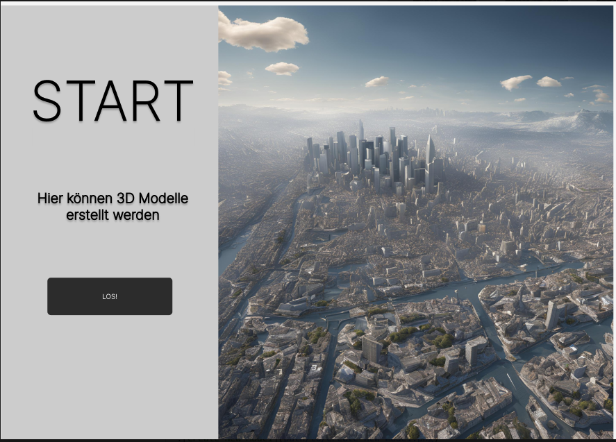
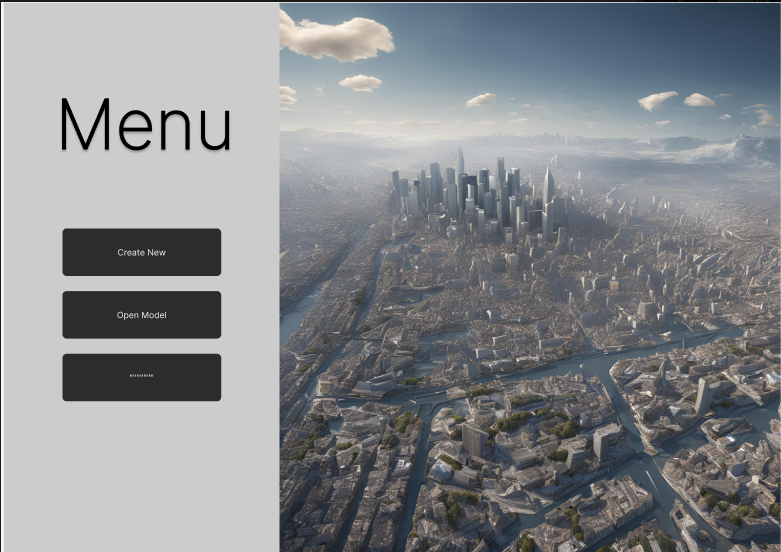
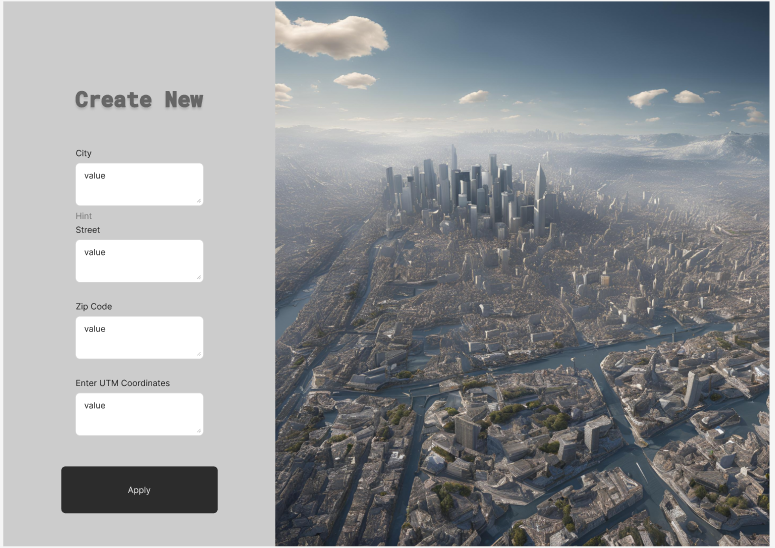
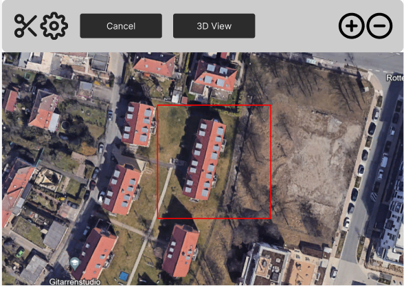
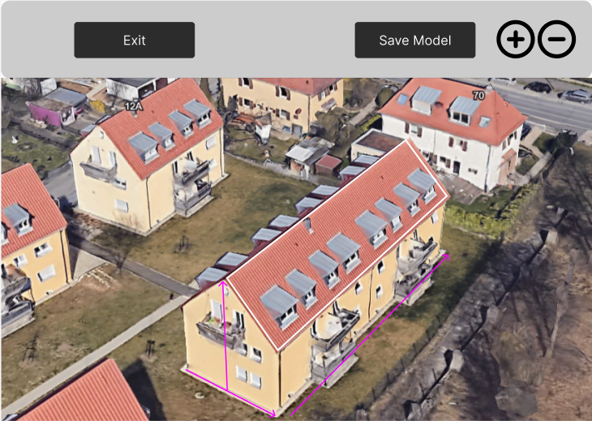

Frontend Documentation
======================
*by Jan Schittenhelm*

This chapter explains how our frontend looks like and how we use it. Further, this chapter will describe how we started to developed the user interface and explains every single function.

First, the early development process of the frontend is explained in detail.

The Beginnings: Conceptualization and Design of the Frontend
------------------------------------------------------------

Before the actual implementation began, it was essential to have a clear vision of how the frontend of the software tool should look and function. To achieve this, **Figma** was used, a tool for designing and prototyping user interfaces. 

Figma allowed for rapid visualization of ideas and experimentation with different design options. Its collaborative features made it possible to gather early feedback from team members and ensure the design aligned with the project's requirements.

Getting Started with Figma
--------------------------
The initial step involved creating basic layouts that reflected the key components and functionalities of the frontend. The following aspects were taken into account:

- **Usability**: The interface should be intuitive and easy to use.
- **Aesthetics**: A modern and appealing design that reflects the purpose of the tool.

Start Page
----------

The **Start Page** serves as the entry point of the application. It provides users with an intuitive and minimalistic interface to start creating 3D models. The page features a visually engaging background image and a clear call-to-action button labeled "LOS!" to guide users toward the next step. 

This design focuses on simplicity, ensuring that users can quickly understand the purpose of the application and proceed without distractions.

Menu Page
---------
The **Menu Page** acts as the central hub for navigation within the application. It provides users with clear options to either create a new 3D model or open an existing one. The page uses a clean and organized layout, with easily recognizable buttons such as "Create New" and "Open Model."

This design ensures that users can quickly access their desired functionality, maintaining both usability and aesthetic appeal.

Create New Page
---------------

The **Create New Page** allows users to input the necessary details to create a new 3D model. It features a clean and simple form where users can fill in fields such as:

- **City**: Specifies the location for the model.
- **Street**: Provides additional address information.
- **Zip Code**: Identifies the region for the model.
- **UTM Coordinates**: Allows precise geospatial input for model creation.

In the very beginning it was essential that this data is the key to command the backend from which area a 3D model should be generated.

At the bottom of the form, there is an "Apply" button to submit the entered details and proceed to the next step. The design prioritizes clarity and ease of use, ensuring a smooth workflow for the user.

Finally the user receives back a satelit picture of the chosen adress input and can create its 3D model:

Based on this FIGMA project, we developed our frontend as discussed below.

React Technologies
-----
React was chosen as the frontend framework for this project due to its numerous advantages in building modern, scalable, and maintainable web applications. Combined with TypeScript, it provides an efficient development environment.

Advantages of React
-------------------

1. **Component-Based Architecture**:  
   React enables the creation of reusable, self-contained components. This makes the code modular and easier to maintain, as each component can be developed and tested independently.

2. **Virtual DOM**:  
   React's Virtual DOM optimizes rendering performance by efficiently updating only the parts of the user interface that have changed, resulting in a smoother user experience.

3. **Large Ecosystem and Community Support**:  
   With React being one of the most popular frontend frameworks, it has a vast ecosystem of libraries and tools, as well as extensive community support, ensuring that issues can be quickly resolved.

4. **Declarative Syntax**:  
   React's declarative syntax allows developers to describe the user interface clearly, making the code easier to read and debug.

Advantages of TypeScript
------------------------

1. **Static Typing**:  
   TypeScript adds static typing to JavaScript, reducing runtime errors by catching type-related bugs during development.

2. **Improved Developer Productivity**:  
   With TypeScript, features like autocompletion, code navigation, and refactoring become more robust, making the development process faster and more efficient.

3. **Better Maintainability**:  
   TypeScript enforces strong typing and clearer code structure, which makes the project easier to maintain, especially in large-scale applications.

4. **Compatibility with React**:  
   TypeScript integrates seamlessly with React, enabling type-safe components and props. This reduces potential issues when passing data between components.

By using React with TypeScript, the project benefits from a modern, scalable, and developer-friendly environment. The combination enhances productivity, reduces errors, and ensures a high-quality codebase that is maintainable in the long run. In the following section below, results are presented.

Technology Stack
-----------------
- **React**: Interactive and responsive UI.
- **React Router**: Handles navigation between views.
- **@react-three/fiber** and **three.js**: 3D rendering and visualization.
- **TypeScript**: Provides type safety and robust development experience.

Development of the final Frontend Views and connection to the Backend
-----------------------
*by Jasmin Fabijanov*

In this section, the final frontend views, their development and connection to the backend API endpoints is described in detail.
The TerraVision frontend was meticulously designed to complement the backend’s powerful geospatial capabilities with a user-centric and visually appealing interface. Developed using React and styled in Apple’s minimalist UI aesthetic, the frontend enables users to interact seamlessly with TerraVision’s features, including address input, depth map visualization, 3D model interaction, and downloadable assets. This section delves into the development process of the frontend, highlighting the components, challenges faced, and solutions implemented.

**Overview over Frontend Pages**
`AddressInput.tsx`
- A single input field for the address with a submit button styled in Apple UI fashion.
- Background image fills the entire screen.

`ShowAerialImage.tsx`
- Displays the satellite image in a centered, translucent frame.
- Includes a dropdown menu to select the depth prediction model.
- Download button for the satellite image is incorporated.

`PredictionDisplay.tsx`
- Displays both the satellite image and the depth map in Apple UI-style translucent frames.
- "Show 3D Model" button to navigate to the 3D visualization page.

`View3.tsx`
- Interactive 3D visualization of the mesh generated from the depth map.
- Includes volume and area calculations displayed in the sidebar.

**Frontend Dockerization**

The frontend is packaged into a Docker container to standardize the development and deployment environment.

1. Base Image: A Node.js image is used as the base, ensuring compatibility with React and TypeScript.
2. Dependency Installation: package.json is used to install all required npm packages.
3. Build Process: The application is built using Vite, producing a lightweight static build.
4. Static File Serving: The built files are served using a lightweight HTTP server, such as serve, within the container.

Architectural Overview
--------------------------

The frontend architecture was structured around React components, with each page and functionality encapsulated into reusable and modular elements. TypeScript was employed to ensure type safety, improving code maintainability and minimizing runtime errors. The use of `@react-three/fiber` and `three.js` enabled interactive 3D rendering, while React Router provided seamless navigation between pages.

**Pages and Functionalities**

Address Input Page
------------------

The **AddressInput.tsx** page serves as the entry point for the user, where an address can be entered to initiate geospatial data processing. The page design adheres to Apple’s UI style, featuring:
- A **rounded input field** with a soft 3D effect, styled to resemble elements in Apple’s native applications.
- A **submit button** with rounded corners and a subtle gradient, providing a tactile, modern appearance.
- A **full-screen background image** that is slightly shifted downward for aesthetic balance.

**Challenges:**
- **Responsive Design**: Ensuring the address input field and submit button remained centered on screens of various sizes.
- **Styling Consistency**: Achieving the soft 3D effect required experimentation with CSS shadows and gradients.

**Solutions:**
- Used a combination of CSS flexbox and media queries to center elements dynamically.
- Styled components with detailed box-shadow layers to achieve the desired aesthetic.

Aerial Image Display Page
-------------------------

The **ShowAerialImage.tsx** page displays the satellite image fetched from the backend and provides a dropdown menu for selecting a depth prediction model. Key features include:
- A **translucent sidebar** styled in Apple UI design, displaying the selected address and model.
- A **dropdown menu** styled as an interactive, modern element.
- A **downloadable satellite image** framed by a slightly translucent box with a subtle shadow for emphasis.

**Challenges:**
- **Image Scaling and Framing**: Ensuring the satellite image maintained its aspect ratio while fitting neatly within the translucent frame.
- **Dropdown Menu Styling**: Making the dropdown menu visually consistent with the rest of the page while retaining functionality.

**Solutions:**
- Applied `object-fit` styling to maintain the satellite image’s aspect ratio within the quadratic frame.
- Customized dropdown styles using CSS to match the page’s Apple-inspired design.

Prediction Display Page
--------------------------

The **PredictionDisplay.tsx** page extends the functionality of the aerial image display by incorporating the depth map. Both the satellite image and depth map are displayed side by side, each framed by translucent boxes.
- A new **"Show 3D Model"** button was added under the model selection, matching the Apple-style design.
- Both images are centrally aligned, with equal gaps between them and the sidebar.

**Challenges:**
- **Alignment of Elements**: Ensuring both images appeared centered and balanced with respect to the sidebar and each other.
- **Maintaining Quadratic Frames**: Scaling both images to fit within their respective frames without distortion.

**Solutions:**
- Used CSS grid layouts to position elements precisely, with consistent padding and margins.
- Applied dynamic resizing based on the viewport to maintain quadratic dimensions.

3D Visualization Page
---------------------

The **View3.tsx** page offers an interactive visualization of the 3D mesh generated by the backend. It includes:
- A **rotating 3D model** rendered using `@react-three/fiber` and `three.js`, with OrbitControls for zooming and rotation.
- A sidebar displaying volumetric and footprint data, styled in line with the other pages.
- A **download button for the 3D mesh**, represented as a subtle icon integrated into the sidebar.

**Challenges:**
- **Mesh Centering**: Ensuring the 3D model appeared centered within the canvas, irrespective of its dimensions.
- **Performance Optimization**: Rendering large meshes in real-time without significant lag or stuttering.

**Solutions:**
- Used `computeBoundingBox` and translation methods from `three.js` to center the mesh dynamically.
- Limited the mesh’s initial scale and resolution during loading to improve performance.

Cross-Cutting Challenges
-------------------------------

1. **Apple UI Styling Consistency**:
   Maintaining a cohesive Apple-style UI across all pages required meticulous attention to detail, particularly with shadows, gradients, and translucency. Consistent visual elements, such as rounded corners and soft 3D effects, were applied throughout.

2. **Responsive Design**:
   Ensuring all components remained visually balanced and functional across devices with varying screen sizes involved extensive use of CSS flexbox and grid layouts.

3. **Frontend-Backend Integration**:
   Fetching and displaying assets like images, depth maps, and meshes from the backend required robust error handling to manage failed or slow API responses.

**Solutions**:
- Integrated fallback messages (e.g., "Loading..." or error indicators) for slow or failed fetch operations.
- Used `async/await` and `.catch` to manage fetch errors gracefully and ensure state updates.

Through meticulous design and implementation, the TerraVision frontend bridges the gap between complex geospatial analytics and end-user interaction, offering a seamless and engaging experience.

