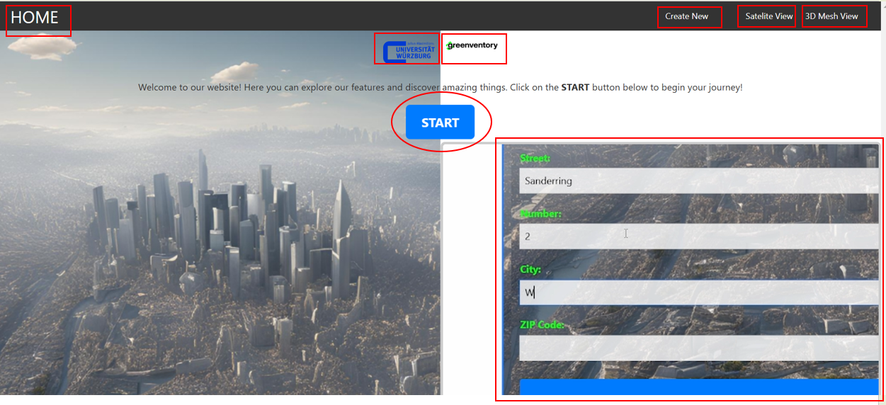

Frontend Documentation
======================

This chapter explains how our frontend looks like and how we use it. Further, this chapter will describe how we started to develop the user interface and explains every single function.

The Beginnings: Conceptualization and Design of the Frontend
------------------------------------------------------------

Before the actual implementation began, it was essential to have a clear vision of how the frontend of the software tool should look and function. To achieve this, **Figma** was used, a tool for designing and prototyping user interfaces. 

Figma allowed for rapid visualization of ideas and experimentation with different design options. Its collaborative features made it possible to gather early feedback from team members and ensure the design aligned with the project's requirements.

Getting Started with Figma
--------------------------
The initial step involved creating basic layouts that reflected the key components and functionalities of the frontend. The following aspects were taken into account:

- **Usability**: The interface should be intuitive and easy to use.
- **Aesthetics**: A modern and appealing design that reflects the purpose of the tool.

Start Page
----------

The **Start Page** serves as the entry point of the application. It provides users with an intuitive and minimalistic interface to start creating 3D models. The page features a visually engaging background image and a clear call-to-action button labeled "LOS!" to guide users toward the next step. 

.. image:: ../static/images/FIGMAStart.png

This design focuses on simplicity, ensuring that users can quickly understand the purpose of the application and proceed without distractions.

Menu Page
---------
The **Menu Page** acts as the central hub for navigation within the application. It provides users with clear options to either create a new 3D model or open an existing one. The page uses a clean and organized layout, with easily recognizable buttons such as "Create New" and "Open Model."

.. image:: ../static/images/FIGMAMenu.png

This design ensures that users can quickly access their desired functionality, maintaining both usability and aesthetic appeal.

Create New Page
---------------

The **Create New Page** allows users to input the necessary details to create a new 3D model. It features a clean and simple form where users can fill in fields such as:

.. image:: ../static/images/FIGMACreateNew.png

- **City**: Specifies the location for the model.
- **Street**: Provides additional address information.
- **Zip Code**: Identifies the region for the model.
- **UTM Coordinates**: Allows precise geospatial input for model creation.

In the very beginning it was essential that this data is the key to command the backend from which area a 3D model should be generated.

At the bottom of the form, there is an "Apply" button to submit the entered details and proceed to the next step. The design prioritizes clarity and ease of use, ensuring a smooth workflow for the user.

Finally the user receives back a satelit picture of the chosen adress input and can create its 3D model:

.. image:: ../static/images/FIGMASatelit.png

Based on this FIGMA project, we developed our frontend as discussed below.

React Technologies
-----
React was chosen as the frontend framework for this project due to its numerous advantages in building modern, scalable, and maintainable web applications. Combined with TypeScript, it provides an efficient development environment.

Advantages of React
-------------------

1. **Component-Based Architecture**:  
   React enables the creation of reusable, self-contained components. This makes the code modular and easier to maintain, as each component can be developed and tested independently.

2. **Virtual DOM**:  
   React's Virtual DOM optimizes rendering performance by efficiently updating only the parts of the user interface that have changed, resulting in a smoother user experience.

3. **Large Ecosystem and Community Support**:  
   With React being one of the most popular frontend frameworks, it has a vast ecosystem of libraries and tools, as well as extensive community support, ensuring that issues can be quickly resolved.

4. **Declarative Syntax**:  
   React's declarative syntax allows developers to describe the user interface clearly, making the code easier to read and debug.

Advantages of TypeScript
------------------------

1. **Static Typing**:  
   TypeScript adds static typing to JavaScript, reducing runtime errors by catching type-related bugs during development.

2. **Improved Developer Productivity**:  
   With TypeScript, features like autocompletion, code navigation, and refactoring become more robust, making the development process faster and more efficient.

3. **Better Maintainability**:  
   TypeScript enforces strong typing and clearer code structure, which makes the project easier to maintain, especially in large-scale applications.

4. **Compatibility with React**:  
   TypeScript integrates seamlessly with React, enabling type-safe components and props. This reduces potential issues when passing data between components.

By using React with TypeScript, the project benefits from a modern, scalable, and developer-friendly environment. The combination enhances productivity, reduces errors, and ensures a high-quality codebase that is maintainable in the long run. In the following section below, results are presented.

Home Screen
-----------

Main purpose of the home-screen is to welcome the user and introduce him to the application.
Inside the image above, all interacttive fields are colored red. On the top the user will find a navigation bar with several functions (see).
To reach the adress-input mask the user can click on "Create New" or the "Start" button in the center.
If "Satelite View" is clicked, the user can receive a preview of the satelite picture to the entered adress data.
To see the 3D Model, "3D Mesh View" has to be selected. Next the logos of University Würzburg and our partner Greenventory can be clicked to reach their websites for futher info.
On the right-down corner, the user can view a video-clip which summarizes main function of our frontend shortly.

*by Jan Schittenhelm*

Technology Stack
-----------------
- **React**: Interactive and responsive UI.
- **React Router**: Handles navigation between views.
- **@react-three/fiber** and **three.js**: 3D rendering and visualization.
- **TypeScript**: Provides type safety and robust development experience.

Frontend Views
--------------

### `AddressInput.tsx`
- A single input field for the address with a submit button styled in Apple UI fashion.
- Background image fills the entire screen.

### `ShowAerialImage.tsx`
- Displays the satellite image in a centered, translucent frame.
- Includes a dropdown menu to select the depth prediction model.
- Download button for the satellite image is incorporated.

### `PredictionDisplay.tsx`
- Displays both the satellite image and the depth map in Apple UI-style translucent frames.
- "Show 3D Model" button to navigate to the 3D visualization page.

### `View3.tsx`
- Interactive 3D visualization of the mesh generated from the depth map.
- Includes volume and area calculations displayed in the sidebar.

