Implemented Models
===================
Depth Anything V2
------------------
*by Jasmin Fabijanov and Evalotta Horn*

The Depth Anything V2 model is a perfect fit for this project as it is a powerful tool for performing monocular depth estimation. [#]_ There are five key reasons that support our choice of this model:

- **High accuracy and robustness:** Depth Anything V2 delivers robust results for complex scenes. In our project, the focus is primarily on buildings, but we utilized diverse landscapes across North Rhine-Westphalia (NRW) to train and test the model. This includes cluttered layouts, which the model handles effectively. It also produces finer details compared to other models, which is particularly advantageous when analyzing the intricate structures of rooftops.
- **Efficiency and scalability:** The model is characterized by high efficiency, as it is faster than comparable models. At the same time, it offers versions in different sizes (25M to 1.3B parameters), making it flexible for various applications and hardware requirements. This was a significant advantage for us, as we relied on the computing resources of Google Colab rather than high-performance computers.
- **Low memory requirements with high performance:**  Depth Anything V2 requires less memory while still achieving superior accuracy in many benchmarks. Even the smallest version of the model often outperforms heavyweight competitors. This was also an advantage for us, as we used Google Colab during this project.
- **Training with high quality data:** The model is pretrained on synthetic images with precise depth information, which avoids issues such as label noise and missing details often found in real-world images. For our project, we fine-tuned the model using high-quality LiDAR data, which provided accurate and reliable depth information. Therefore we were able to maintain the high quality.
- **Comparison with other methods:** Depth Anything V2 outperforms other popular models, such as Depth Anything V1 and MiDaS, in both benchmarks and visual quality. It successfully combines the strengths of generative and discriminative approaches to produce accurate, realistic depth maps.

Zoe Depth 
----------
*by Matthäus Surafial*

Baseline Model 
---------------
*by Evalotta Horn*

The baseline model serves as a reference for evaluating the performance and improvement of other models. It enables an objective assessment of the work. We selected a segmentation model from the PyTorch open-source machine learning library. The model follows a U-Net architecture and was implemented using the Segmentation Models PyTorch (smp) library, which specializes in image segmentation tasks. [#]_

.. code-block:: python

    model = smp.Unet(
        encoder_name="resnet34",  
        encoder_weights="imagenet",
        in_channels=3,  
        classes=1  
    )

In this architecture, the encoder extracts features from the input image, while the decoder restores these features to their original resolution. U-Net uses skip connections to combine low-resolution features from the encoder with high-resolution features from the decoder, enhancing the segmentation accuracy. For this project, we used ResNet34 as the backbone. ResNet34 is a convolutional neural network (CNN) originally developed for classification tasks. It is both efficient and versatile, providing strong results across various applications.

The encoder was initialized with pre-trained weights from the ImageNet dataset. This pre-training allows the encoder to effectively extract general features from images, such as edges and shapes. The model accepts RGB images (three input channels for red, green, and blue) and outputs a single segmentation class, enabling binary segmentation.

This model aligns well with the objectives of this project seminar, as typical applications include autonomous driving and satellite imagery. These use cases involve segmenting roads, buildings, forests, or bodies of water, making the model well-suited for tasks like identifying structures from aerial views.

During development, we also considered the FastAI library. [#]_ However, its implementation was significantly more complex than the smp library and did not yield successful results. In contrast, smp.Unet offers more precise image segmentation, greater flexibility in choosing encoders and architectures, and seamless GPU support. Additionally, it allows users to leverage pre-trained models, further simplifying development.

For optimization, we used the Huber Loss function and the Adam optimization algorithm. Adam, short for Adaptive Moment Estimation, combines the advantages of AdaGrad (adaptive learning rates) and RMSprop (scaling learning rates based on gradient variance). It provides fast convergence, adaptive learning rates per parameter, and robustness to noisy gradients.

The Huber Loss function merges the properties of the mean absolute error (MAE) and mean squared error (MSE). Its key advantages include flexibility through the delta parameter, which defines the threshold for transitioning between quadratic and linear behavior. This makes the Huber Loss robust to outliers due to its linear behavior beyond delta. Additionally, the smooth derivative of the Huber Loss for small errors enables more stable gradients and efficient training.

.. code-block:: python
    
    huber_loss_fn = HuberLoss(reduction='mean', delta=1.0)
    optimizer = torch.optim.Adam(model.parameters(), lr=1e-4)

.. code-block:: python
    
        # Forward pass
        outputs = model(images)

        # Calculate loss
        loss = huber_loss_fn(outputs, depths)

        # Backward pass and optimization
        optimizer.zero_grad()
        loss.backward()
        optimizer.step()

        running_loss += loss.item()

The baseline model was trained using a standard supervised learning approach. During each training iteration, the model performed a forward pass to generate predictions (outputs) based on the input images. The Huber Loss function was then used to compute the loss between the predicted outputs and the ground truth depth values (depths). A backward pass calculated the gradients of the loss with respect to the model parameters, which were subsequently updated using the Adam optimizer. The training loop also accumulated the loss values to monitor the model's performance across iterations. This process ensured the model was progressively optimized for accurate depth prediction. Ten epochs were choosen for the training loop. 

.. code-block:: python

    train_model(model, train_loader, optimizer, huber_loss_fn, epochs=epochs)

Comparison of the Models
--------------------------
*by Evalotta Horn*

To analyse and compare the models, we used two approaches. Firstly, we examined the test and training losses, and secondly, we compared the depth maps with the true depth map derived from LiDAR data across different categories.

**Trainings and Test losses**

All three models were trained for ten epochs on the same dataset, consisting of orthophotos and LiDAR data from North Rhine-Westphalia (NRW). The training data was used in the same order for consistency.

The training loss for the *Basic Model* starts at 3.4906 and decreases steadily to 1.1148, showing that the model learns to reduce errors during training. However, the average test loss is 1.870, resulting in a significant difference of 0.7556 between training and test loss. This indicates that the Basic Model suffers from overfitting: it has overfitted the training data but generalises poorly to unseen data.
While the Basic Model minimises the training loss effectively, it fails to reconstruct finer details in the depth maps, resulting in poor-quality predictions. The architecture of the model is likely too simple to fully capture the complexity of the depth relationships in the data. As a result, the Basic Model is unsuitable for practical applications due to its poor generalisation and subpar depth map quality, despite achieving a low training loss.

The training loss for *Depth Anything V2* begins at 2.1238 and decreases to 1.7315, while the average test loss is 1.8317. The difference between training and test loss is 0.6247, indicating better generalisation compared to the Basic Model.
The ResNet34 encoder used in Depth Anything V2 is more robust and pre-trained on ImageNet, allowing the model to extract complex features. This results in better depth maps with clearer edges and fewer artefacts. The combination of the U-Net architecture and ResNet34 backbone enhances both feature extraction and processing efficiency. While its test loss is slightly higher than that of the Basic Model, the visual quality of the generated depth maps is significantly better. This balance between training and test loss highlights Depth Anything V2 as a robust model suitable for real-world applications.

The training loss for *ZoeDepth* starts at 4.513 and decreases to 1.7311, with an average test loss of 1.5679—the lowest among all three models. Interestingly, ZoeDepth achieves the lowest test loss despite having a higher final training loss compared to the other models.
This suggests that ZoeDepth generalises best. Its performance can be attributed to its optimised U-Net architecture, which likely incorporates special regularisation techniques to prevent overfitting. ZoeDepth demonstrates that architecture and training strategies significantly influence generalisation capability. However, despite its low test loss, the depth maps from ZoeDepth are not as detailed or precise as those generated by Depth Anything V2.

The comparison of the models shows that a low training loss does not necessarily translate to better performance. Depth Anything V2 and ZoeDepth, both designed for better generalisation, outperform the Basic Model both quantitatively (test loss) and qualitatively (depth maps). Among these, Depth Anything V2 demonstrates the best balance between test loss, generalisation, and visual quality. While ZoeDepth achieves the lowest test loss, Depth Anything V2 produces clearer and more detailed depth maps that closely match the true depth map, making it the most suitable choice for applications requiring both precision and robustness.

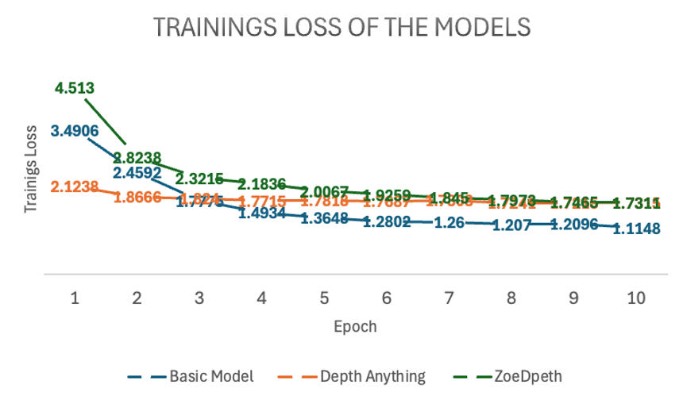

Above, we discussed the average test losses of the three models. The following graph shows the test losses for each batch across all models, highlighting the fluctuations and variations.

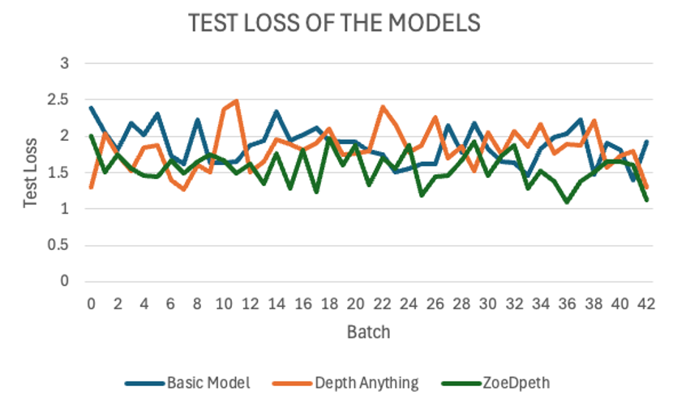

The graph reveals significant fluctuations in test losses across batches. This variability is likely due to the diverse test dataset, which includes various regions of NRW such as fields, forests, water bodies, and urban areas. This diversity demonstrates the models' varying strengths in handling different categories. Unfortunately, due to time constraints, we did not analyse the individual batches to identify the specific orthophotos that contributed to these variations.

The *Basic Model* exhibits high fluctuations in test loss and generally remains above the values of the other models. Its instability is evident, with peaks reaching nearly 2.5.

*Depth Anything V2* shows more stability compared to the Basic Model, but still exhibits some fluctuations. Its test loss typically ranges between 1.5 and 2.0, making it comparable to ZoeDepth in this range.

*ZoeDepth* achieves the lowest average loss and exhibits the smallest fluctuations among the three models. Its test loss consistently remains around or below 1.5, indicating its superior stability.

Depth Anything V2 and ZoeDepth often show similar test losses, particularly between batches 10 and 30, where their curves overlap. However, Depth Anything V2 tends to have slightly higher fluctuations, especially between batches 15 and 25, where ZoeDepth remains more stable. Despite these differences, both models perform significantly better than the Basic Model in terms of stability and test loss.

The analysis highlights that Depth Anything V2 is the most balanced model, achieving a good trade-off between generalisation, test loss, and depth map quality. While ZoeDepth excels in achieving the lowest test loss and stability, Depth Anything V2 produces more detailed and accurate depth maps, making it better suited for applications where precision is critical. The Basic Model, despite its low training loss, performs the poorest due to its limited architecture and poor generalisation capabilities.

**Depth Maps**

In the next step, we will look at the visualisation of the results. To have the best comparison, we chose various orthophotos from the test data set and are going to compare the depth maps of the three different models but also to the true depth map. The orthophotos are meant to cover the biggest variety of areas in NRW.

.. figure:: ../static/images/predicted_depth_map2_516000.0_5759000.0_part_2_1.png
    :alt: Depth Maps of residential area
    :align: center

    Depth Maps 1: Residential area 

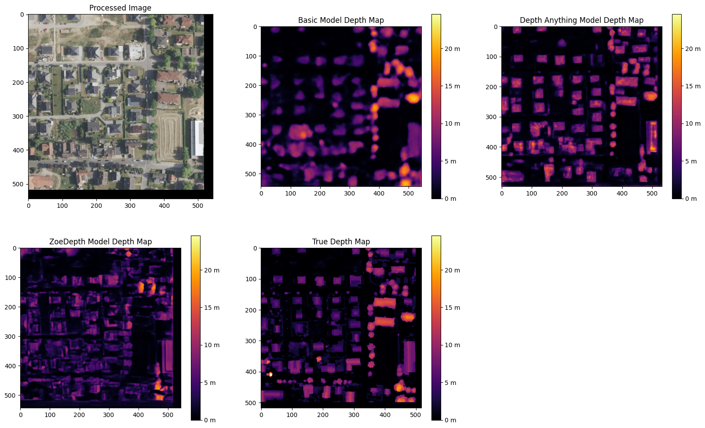

    Depth Maps 2: Residential area 

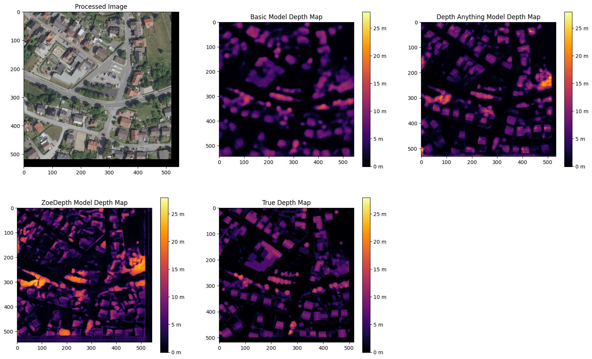

    Depth Maps 3: Residential area 

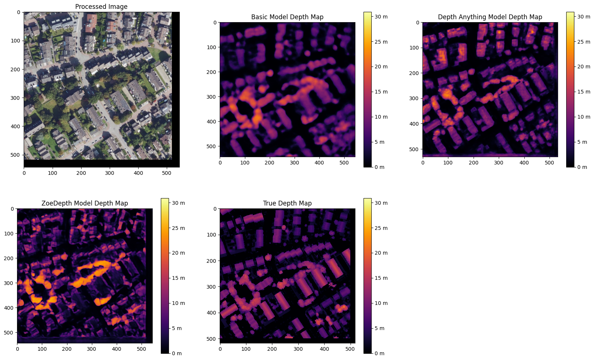

    Depth Maps 4: Residential area 

The four images above all show Depth Maps of residential areas, meaning a lot of single familiy homes without many nature in between. 

The *Baseline Model* shows limited capability in capturing intricate details of residential areas. Its depth maps are often blurred, with poorly defined building edges and structures. Smaller features, such as vegetation or small buildings, are almost completely ignored, and the model struggles to differentiate slight variations in height. Buildings are not clearly separated from one another, and smaller height differences between elements like streets and structures are indistinguishable. These limitations make the Baseline Model inadequate for accurately representing residential areas.

The *Depth Anything V2 model* demonstrates the ability to produce the most detailed and precise depth maps among the evaluated models. The structures in residential areas are sharply defined, with accurate depth gradients for larger features, such as rooftops. Fine-tuning has enhanced the model's capacity to capture subtle depth variations, leading to superior performance in complex scenes. While it correctly identifies height differences between streets and buildings, it struggles with smaller details, such as cars, garages, or low structures, which are often not represented. Additionally, in some cases, the model inconsistently applies height information across entire structures, leading to patchy results. For instance, in Depth Map 1, the elongated building at the bottom right is inaccurately represented at the highest parts of the roof underestimated. While the model handles large structures well, it struggles with gabled roofs and smaller architectural nuances.

The *ZoeDepth model* provides detailed representations of structures such as buildings, streets, and vegetation, and its depth maps exhibit finer height differences for smaller features. It performs well in shadowed areas, where it often produces more accurate depth estimates. The model captures roof structures, including sloped roofs, with a higher degree of accuracy compared to other models. However, ZoeDepth tends to exaggerate height differences, resulting in a less realistic overall representation, as seen in Depth Map 3. In Depth Map 2, ZoeDepth fails to correctly identify or classify two tall buildings on the right-hand side, which are clearly visible in the True Depth Map. Additionally, while vegetation and smaller structures are rendered more realistically, transitions between high and low regions can appear abrupt. Height exaggeration and occasional artifacts, particularly in areas with trees, further diminish the model's alignment with reality.

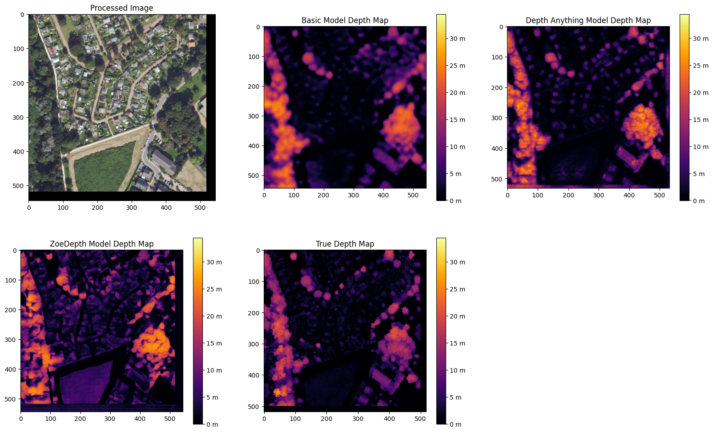

    Depth Maps 5: Suburbs

    
    Depth Maps 6: Suburbs

The two images of the suburbs differ from the residential areas that they are more rural, triggered by more trees, gardens and fields inbetween and around.

The *baseline model* performs poorly once again. Similar to the residential areas, it remains blurred and inaccurate. Buildings and vegetation are barely distinguishable from each other, and the depth information appears overly smoothed.

*Depth Anything V2* still struggles to recognise smaller vegetation, has difficulties with the slopes of pitched roofs, and slightly overestimates the height of trees. However, it demonstrates clear distinctions, as seen in Depth Map 5, where the small houses are clearly contrasted with the tall trees.

*ZoeDepth* performs better in recognising height differences in tree structures and shows clear transitions between high and low areas. However, it tends to exaggerate heights, particularly with trees, which often appear taller than they actually are. It also struggles with the grassy area at the bottom centre of Depth Map 5, incorrectly estimating its height. Additionally, ZoeDepth has considerable difficulties in correctly capturing the height and shape of the roofs in Depth Map 6. Many roofs are either not recognised as elevated structures or appear flat and unrealistic. Instead of showing the slopes and height differences of gable roofs, ZoeDepth usually shows very low height values or even less height compared to the surrounding streets and gardens.

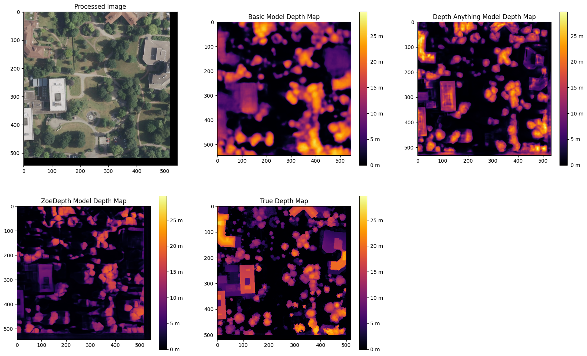

    Depth Maps 7: Campus of larger buildings

From the orthophotos and the true depth map, it can be observed that there are larger buildings, possibly part of a campus, such as a university.

The three models continue to exhibit the same characteristics as before. The *baseline model* is blurry, and objects often blend into one another. Nevertheless, the predicted heights are generally in the right range, and all major buildings and trees are visible.
*Depth Anything V2* still performs the best in predicting heights. All objects are visible and clearly separated from each other. However, the model continues to struggle with roofs, which are not rendered continuously but appear patchy. Additionally, smaller trees or bushes are often missing.
*ZoeDepth* remains effective at predicting height structures in trees but fails to capture some of the larger and very tall buildings in this depth map. It is also noticeable here that the trees in the depth map are not excessively tall, as in all the others. 

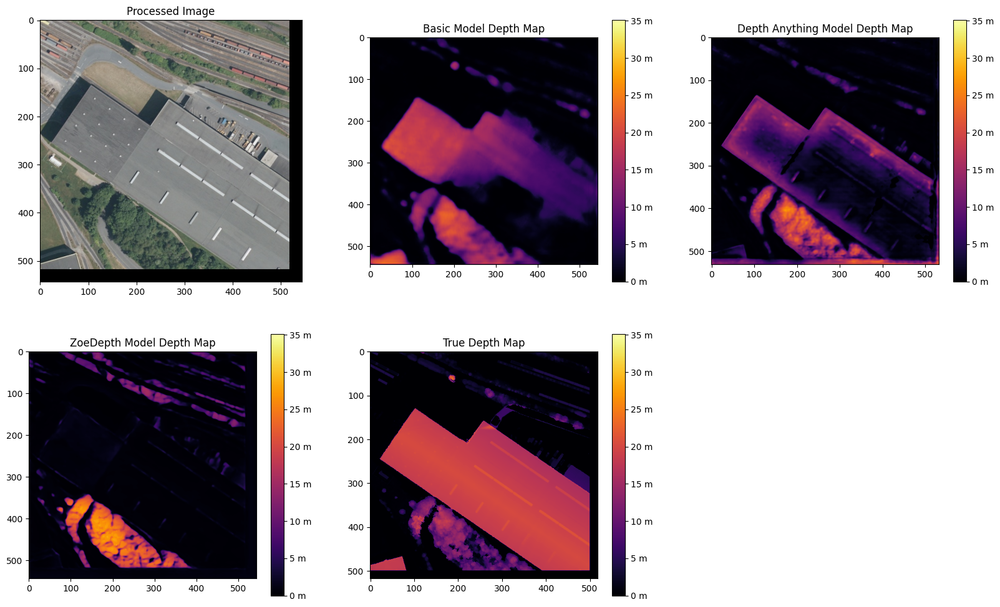

    Depth Maps 8: Industrial area

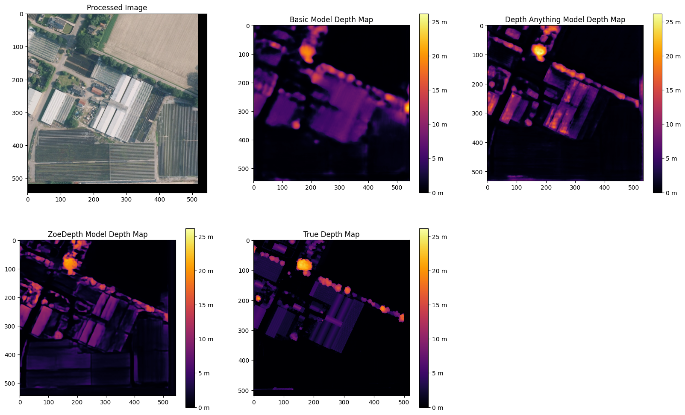

    Depth Maps 9: Garden center 

There is nothing new to mention about the *baseline model*. At the garden center in Depth Map 9, all the buildings are generally visible in the depth map and are mostly predicted at the correct height. However, the map remains blurry, and no details are discernible.
In the industrial area of Depth Map 8, the baseline model struggles to represent the entire roof and only partially predicts the correct height.

The *Depth Anything V2 model* shows a high level of detail and clear separations in Depth Map 9, although it has predicted some heights to be overly extreme. In Depth Map 8, it again struggles with representing a continuous roof surface, only reaching the correct height in very small patches. However, the model captures many details, such as the white transverse and longitudinal beams on the roof, as well as some of the vehicles in front of the hall. The two trains are only partially recognized, with a lack of clear boundaries. The trees are slightly overestimated in height, and the roof corner at the bottom left is barely identifiable.

In the *ZoeDepth model*, the structures of the trees are again well-recognized in Depth Map 8, even though they are overall predicted to be too tall. The details of lorries and trains are also well-captured, in some cases even better than with Depth Anything V2. However, the large industrial building and the roof corner at the bottom left are either completely ignored or incorrectly predicted with a height of zero. In Depth Map 9, the model performs much better, showing more structural details. This improvement could be because ZoeDepth tends to overestimate heights compared to the True Depth Map, which allows smaller heights to appear more clearly. Nevertheless, some roofs, such as those in the top-left area, are still missing.

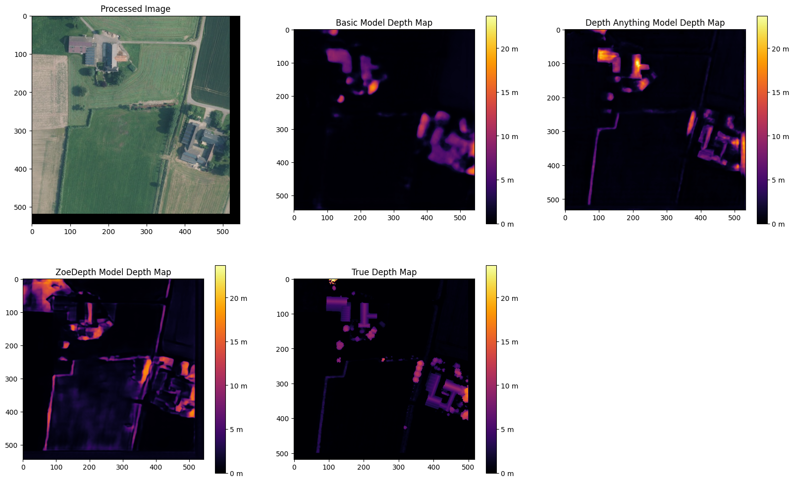

    Depth Maps 10: Farms surrounded by fields

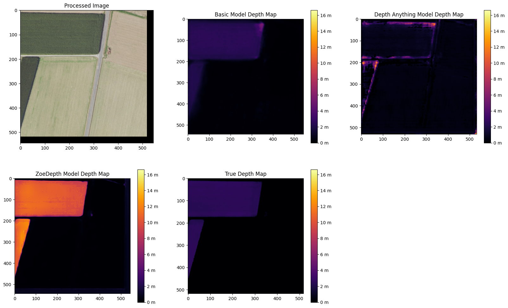

    Depth Maps 11: Fields

Once there are only fields and then also with two houses inbetween, that could be farms. 

.. [#] Yang, L. et al. (2024) “Depth Anything V2.” Available at: http://arxiv.org/abs/2406.09414.
.. [#] Lakubovskii, P. (2014) Segmentation Models’s . Available at: https://smp.readthedocs.io/en/latest/ (Accessed: December 11, 2024).
.. [#] Howard, J. and Thomas, R. (no date) Welcome to fastai. Available at: https://docs.fast.ai (Accessed: December 18, 2024).