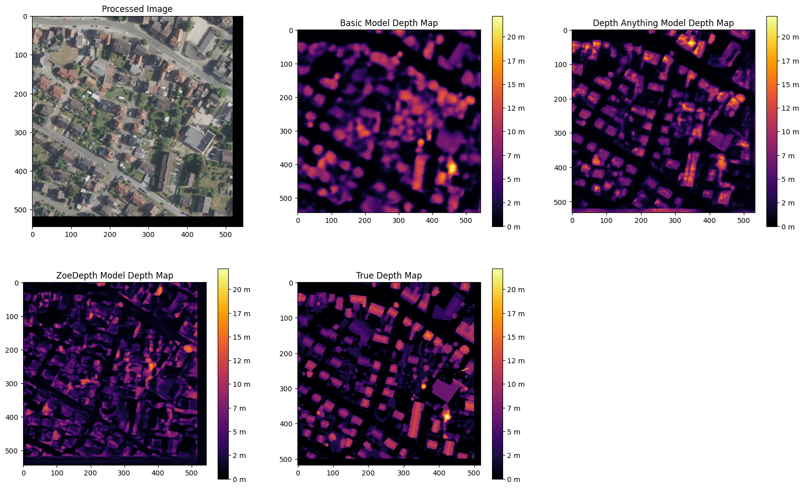

Implemented Models
===================
Depth Anything V2
------------------
*by Jasmin Fabijanov and Evalotta Horn*

The Depth Anything V2 model is a perfect fit for this project as it is a powerful tool for performing monocular depth estimation. [#]_ There are five key reasons that support our choice of this model:

- **High accuracy and robustness:** Depth Anything V2 delivers robust results for complex scenes. In our project, the focus is primarily on buildings, but we utilized diverse landscapes across North Rhine-Westphalia (NRW) to train and test the model. This includes cluttered layouts, which the model handles effectively. It also produces finer details compared to other models, which is particularly advantageous when analyzing the intricate structures of rooftops.
- **Efficiency and scalability:** The model is characterized by high efficiency, as it is faster than comparable models. At the same time, it offers versions in different sizes (25M to 1.3B parameters), making it flexible for various applications and hardware requirements. This was a significant advantage for us, as we relied on the computing resources of Google Colab rather than high-performance computers.
- **Low memory requirements with high performance:**  Depth Anything V2 requires less memory while still achieving superior accuracy in many benchmarks. Even the smallest version of the model often outperforms heavyweight competitors. This was also an advantage for us, as we used Google Colab during this project.
- **Training with high quality data:** The model is pretrained on synthetic images with precise depth information, which avoids issues such as label noise and missing details often found in real-world images. For our project, we fine-tuned the model using high-quality LiDAR data, which provided accurate and reliable depth information. Therefore we were able to maintain the high quality.
- **Comparison with other methods:** Depth Anything V2 outperforms other popular models, such as Depth Anything V1 and MiDaS, in both benchmarks and visual quality. It successfully combines the strengths of generative and discriminative approaches to produce accurate, realistic depth maps.

Zoe Depth 
----------
*by Matthäus Surafial*

Baseline Model 
---------------
*by Evalotta Horn*

The baseline model serves as a reference for evaluating the performance and improvement of other models. It enables an objective assessment of the work. We selected a segmentation model from the PyTorch open-source machine learning library. The model follows a U-Net architecture and was implemented using the Segmentation Models PyTorch (smp) library, which specializes in image segmentation tasks. [#]_

.. code-block:: python

    model = smp.Unet(
        encoder_name="resnet34",  
        encoder_weights="imagenet",
        in_channels=3,  
        classes=1  
    )

In this architecture, the encoder extracts features from the input image, while the decoder restores these features to their original resolution. U-Net uses skip connections to combine low-resolution features from the encoder with high-resolution features from the decoder, enhancing the segmentation accuracy. For this project, we used ResNet34 as the backbone. ResNet34 is a convolutional neural network (CNN) originally developed for classification tasks. It is both efficient and versatile, providing strong results across various applications.

The encoder was initialized with pre-trained weights from the ImageNet dataset. This pre-training allows the encoder to effectively extract general features from images, such as edges and shapes. The model accepts RGB images (three input channels for red, green, and blue) and outputs a single segmentation class, enabling binary segmentation.

This model aligns well with the objectives of this project seminar, as typical applications include autonomous driving and satellite imagery. These use cases involve segmenting roads, buildings, forests, or bodies of water, making the model well-suited for tasks like identifying structures from aerial views.

During development, we also considered the FastAI library. [#]_ However, its implementation was significantly more complex than the smp library and did not yield successful results. In contrast, smp.Unet offers more precise image segmentation, greater flexibility in choosing encoders and architectures, and seamless GPU support. Additionally, it allows users to leverage pre-trained models, further simplifying development.

For optimization, we used the Huber Loss function and the Adam optimization algorithm. Adam, short for Adaptive Moment Estimation, combines the advantages of AdaGrad (adaptive learning rates) and RMSprop (scaling learning rates based on gradient variance). It provides fast convergence, adaptive learning rates per parameter, and robustness to noisy gradients.

The Huber Loss function merges the properties of the mean absolute error (MAE) and mean squared error (MSE). Its key advantages include flexibility through the delta parameter, which defines the threshold for transitioning between quadratic and linear behavior. This makes the Huber Loss robust to outliers due to its linear behavior beyond delta. Additionally, the smooth derivative of the Huber Loss for small errors enables more stable gradients and efficient training.

.. code-block:: python
    
    huber_loss_fn = HuberLoss(reduction='mean', delta=1.0)
    optimizer = torch.optim.Adam(model.parameters(), lr=1e-4)

.. code-block:: python
    
        # Forward pass
        outputs = model(images)

        # Calculate loss
        loss = huber_loss_fn(outputs, depths)

        # Backward pass and optimization
        optimizer.zero_grad()
        loss.backward()
        optimizer.step()

        running_loss += loss.item()

The baseline model was trained using a standard supervised learning approach. During each training iteration, the model performed a forward pass to generate predictions (outputs) based on the input images. The Huber Loss function was then used to compute the loss between the predicted outputs and the ground truth depth values (depths). A backward pass calculated the gradients of the loss with respect to the model parameters, which were subsequently updated using the Adam optimizer. The training loop also accumulated the loss values to monitor the model's performance across iterations. This process ensured the model was progressively optimized for accurate depth prediction. Ten epochs were choosen for the training loop. 

.. code-block:: python

    train_model(model, train_loader, optimizer, huber_loss_fn, epochs=epochs)

Comparison of the Models
--------------------------
*by Evalotta Horn*

To analyse and compare the models, we will use two approaches. Firstly, we will look at the test and training losses and secondly, we will compare the depth maps with the true depth map consisting of lidar data in different categories. At the end we will draw an overall conclusion about the three models. 

**Trainings and Test losses**

.. [#] Yang, L. et al. (2024) “Depth Anything V2.” Available at: http://arxiv.org/abs/2406.09414.
.. [#] Lakubovskii, P. (2014) Segmentation Models’s . Available at: https://smp.readthedocs.io/en/latest/ (Accessed: December 11, 2024).
.. [#] Howard, J. and Thomas, R. (no date) Welcome to fastai. Available at: https://docs.fast.ai (Accessed: December 18, 2024).