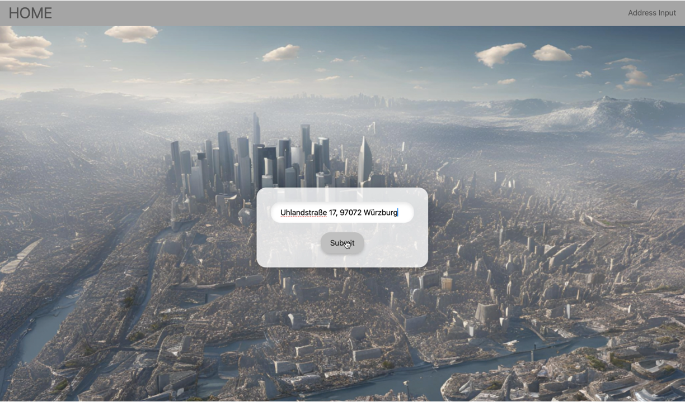
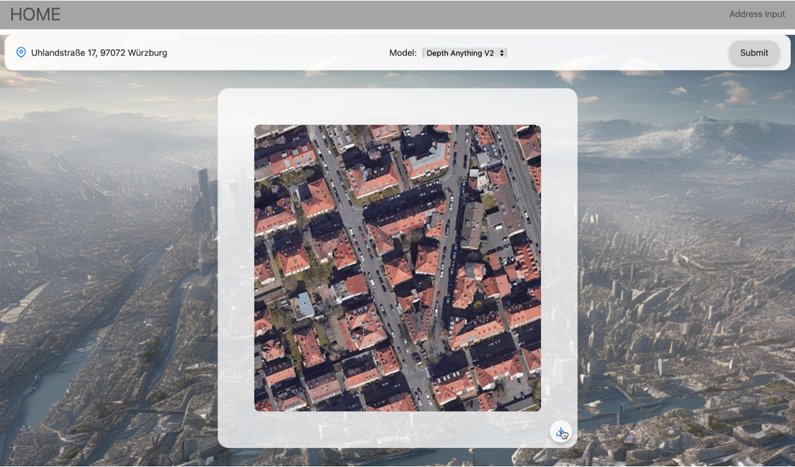
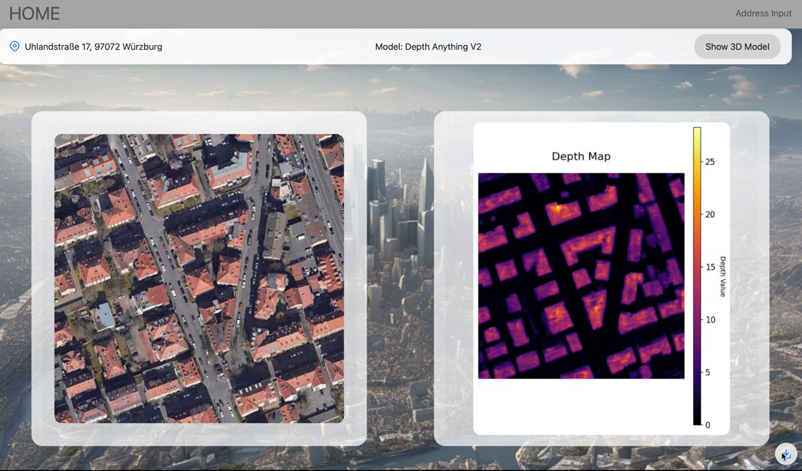
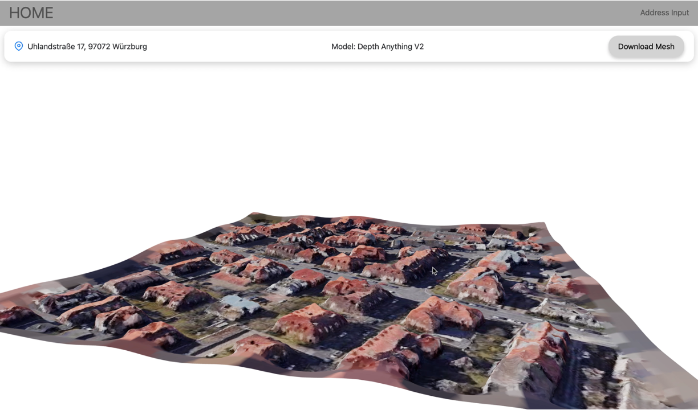

System Overview of Terravision
================
*by Jasmin Fabijanov*

In this documentation you will learn evrything about our seminar project "Terravision" - an advanced application for visualizaing 3D models from 2D satellite imagery relying solely on an address input. 
This project was realised in cooperation with Greenventory, an expert consultant for the energy sector. 
The 3D visualization is based on the depth predictions genrated by three different Monocular Depth Estimation (MDE) Models, that the user can chose from.

Check out the \:doc:`Implemented Models` section for further information.

Features of Terravision
-----------------------

Address-Based Data Retrieval
-----------------------

This feature is the starting point for the whole application. The address input field is located on the front page of the application. 
When submitting the address a backend method is called which returns the corresponding satellite image with the address in the center using the Google Maps Static Api and Google Geocoding Api.

Satellite Image Retrieval and Display
-----------------------

Based on the given address, the corresponding satellite iamge is retrieved by geocoding it with the Google Geocoding API into a center coordinate at the point of the address.
Based on this latitude and longitude the satellite image is retrieved via the Google Maps Static API and the resulting satellite image is displayed on the next page.

Model Predictions
-----------------------

Next, the user can chose one of three trained MDE models form a drop-down menu to predict the depth value of each pixel fo the satellite image:
  - Depth Anything V2
  - Zoe Depth or 
  - the baseline model (ResNet34)
After submitting the chosen model, again, a backend method is called which returns the depth map (heatmap of the satellite image with a height scale legend in meters) of the and next to the corresponding satellite image.

3D Visualization
-----------------------

Then, the user has the ability to let a 3D model be generated from the depth map and satellite image.
In the backend the open3D library is used for calculating a pointcloud and a poisson mesh.
In the frontend the React extension "three-fiber" is used for 3D rendering of the generated poisson mesh.

Downloadable Assets
-----------------------

This feature enables the download of each mentioned element, meaning the satellite image, the depth map and the 3D model.
The file name of each element is specified by the corresponding address and the specific tag for satellite image, depth map or 3D model.

System Architecture
---------------------

The architecture of the application consists of a backend and frontend and is deployed for cross-plattform accessibility using Docker.

**Backend Libraries and Services Used**

- **Flask**: RESTful API development.
- **Open3D**: 3D mesh and point cloud processing.
- **PyTorch**: Depth prediction using advanced ML models.
- **Segmentation Models PyTorch (SMP)**: Used for Unet Baseline depth prediction.
- **Google Maps APIs**: Retrieves satellite imagery and geocodes the address into coordinates.

**Frontend Frameworks Used**

- **React**: Interactive and responsive UI.
- **React Router**: Handles navigation between views.
- **@react-three/fiber** and **three.js**: 3D rendering and visualization.
- **TypeScript**: Provides type safety and robust development experience.